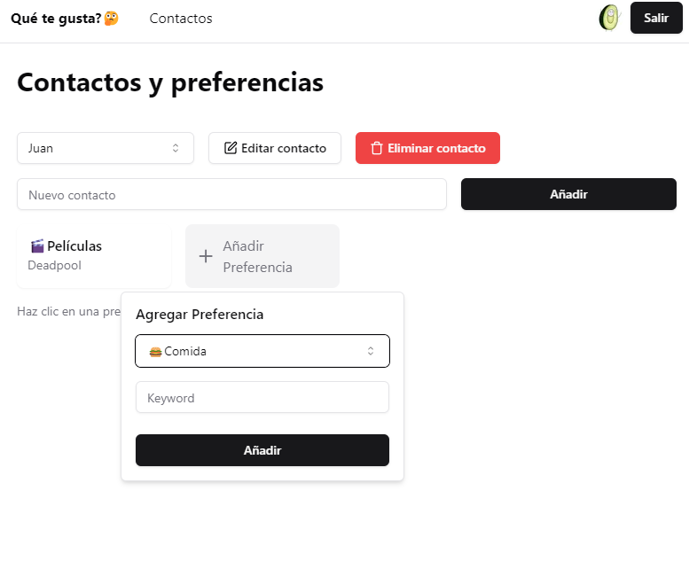
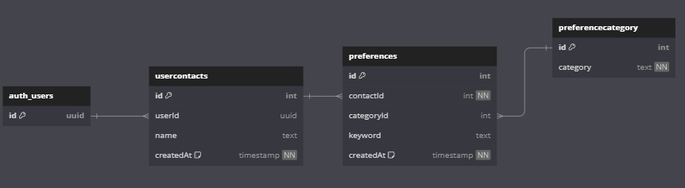

# Qué te gusta?

Una aplicación para guardar los gustos de amigos o familiares.

## Stack Tecnológico

   


## [Preview](https://que-te-gusta.vercel.app/)



## Instalación

### Requisitos

- Supabase
- Google OAuth (supabase)
- Github OAuth (supabase)
- Configurar URL de redirección de autenticación al frontend (supabase)

Una vez configurado Supabase, se debe crear un archivo `.env` en la raíz del proyecto con la URL y la llave de Supabase, además de la dirección del servidor (frontend).

```bash
npm install
```

## Base de datos

Al crear las tablas, se deben configurar los RLS (Row Level Security) para que los usuarios solo puedan ver y modificar sus propios datos.

`auth_users` es una tabla manejada por Supabase, la cual se encarga de guardar los usuarios que se registran en la aplicación.


